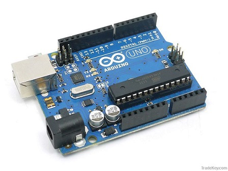
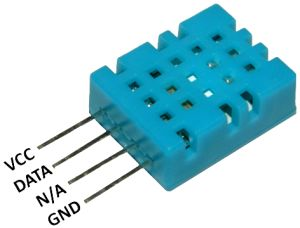

# Thermometer With Python  

* The GUI/Web Real-time serial port monitor with Python
 
   These projects introduce some concepts and technologies to build robust and reliable monitoring software of serial port devices in the easy way.

## HardWare
  
* Board:  [Arduino uno](http://www.arduino.cc/) 



* Sensor: [DHT11](http://playground.arduino.cc/Main/DHT11Lib)



## Layout: Arduino UNO + DHT11  
 ```  
   Connect DHT11 pin 1(VCC,left,power)   ->  Arduino +5V

   Connect DHT11 pin 2(DATA,signal)      ->  your DHTPIN in Arduino UNO,for example pin 3

   Connect DHT11 pin 4(GND,right)        ->  Arduino GROUND

   Connect DHT11 pin 2(DATA,signal)      -> a 10K resistor  ->  DHT11 pin 1 (VCC) 
```


## Arduino sketch  

* Open **ArduinoDHTSensor.ino**, build and upload to Arduino 

## Python and Packages

*  Python3.5 

*  PyQt4, PySerial, PythonQwt, Thread, Tornado

## PyQtArduinoDHT11

* A threaded GUI Monitor with Python and PyQt4 plots live data using PythonQwt

 * Key Points：Python3.5,PyQt4, PySerial, PythonQwt, Thread

* Launching the app
```
    >python DHT_monitor.py
``` 


* The GUI application is modified from: mba7  https://github.com/mba7/SerialPort-RealTime-Data-Plotter,

## TornadoArduinoDHT11

* A web monitor with Tornado web server enables real-time plotting of DHT11 signals in the browser(support websocket)

 * Key Points： tornado server + websocket + flotr2 

*  Enjoying live data on **COM4**

   * if your board serial port is not **COM4**, you may change:
    
      ```python
        def openSerial():
            
            port = 'COM4'  # you shoule change to your board port
       ```

```
  1) Launching the web server

      >python app.py

  2) Open a web browser and go to :

   http://localhost:8000  

  You should see the graph and be able to select the curves to display.
```


## Reference

1. Arduino: http://www.arduino.cc/

2. Arduino and Python: http://playground.arduino.cc/Interfacing/Python

3. DHT11：http://playground.arduino.cc/Main/DHT11Lib

5. PyQt: https://riverbankcomputing.com/software/pyqt/intro

6. PythonQwt： https://github.com/PierreRaybaut/PythonQwt

7. Tornado Web Server: http://www.tornadoweb.org/en/stable/

8. Noah Gift. Practical threaded programming with Python. http://www.ibm.com/developerworks/aix/library/au-threadingpython/index.html

## License

MIT 
